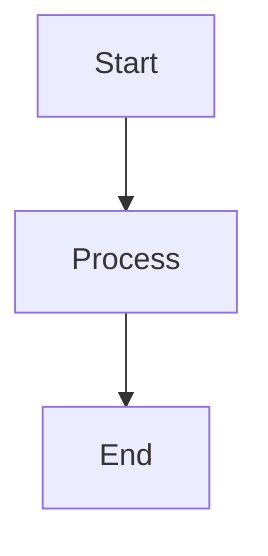

# AGENTS.md — Documentation Standards

## 📌 الغرض من هذا المجلد

هذا المجلد يحتوي على **التوثيق الرسمي** لمنصة مُنتجات. كل ملف `.md` هنا يمثل دليلاً كاملاً لجزء من النظام.

## 📁 الملفات المتاحة

| الملف | الوصف | الجمهور |
|-------|-------|---------|
| `supply_chain_user_guide.md` | دليل استخدام نظام سلسلة التوريد | المستخدمين |

## 📝 معايير التوثيق

### 1. Headers
- استخدام `#` للعناوين الرئيسية
- استخدام `##` للأقسام
- استخدام `###` للفروع

### 2. Code Blocks
- PHP: ` ```php `
- Dart: ` ```dart `
- JavaScript: ` ```javascript `
- JSON: ` ```json `
- Bash: ` ```bash `

### 3. Tables
- استخدام الجداول للمقارنات والقوائم المنظمة
- Header: `| Column 1 | Column 2 |`
- Separator: `|----------|----------|`

### 4. Emojis
- ✅ للإيجابيات
- ❌ للسلبيات
- ⚠️ للتحذيرات
- 🎯 للأهداف
- 📌 للملاحظات

### 5. Mermaid Diagrams


## 🧑‍💼 كتابة دليل مستخدم جديد

### القالب:
```markdown
# 📘 عنوان الدليل
### النظام الفلاني | الإصدار: X.X

---

## 📌 نظرة عامة

### ما يفعله:
- ✅ نقطة 1
- ✅ نقطة 2

### ما لا يفعله:
- ❌ نقطة 1
- ❌ نقطة 2

---

## 🏗️ الهيكل

```
📦 النظام
├── وحدة 1
└── وحدة 2
```

---

## 👥 الصلاحيات

| الدور | الصلاحيات |
|-------|-----------|
| Admin | كامل |
| User | قراءة |

---

## 🔄 سير العمل

### المرحلة 1: ...
```
1️⃣ الخطوة 1
2️⃣ الخطوة 2
```

---

## 📊 شرح الشاشات

### 1. الشاشة الفلانية
| القسم | الوصف | المصدر |
|-------|-------|--------|
| حقل 1 | وصفه | SAP |
| حقل 2 | وصفه | يدوي |

---

## ❓ الأسئلة الشائعة

**س: سؤال؟**
ج: إجابة.

---

## 📞 للدعم
- البريد: support@muntajat.sa
```

## 🌐 اللغة

- التوثيق الرسمي: عربي (افتراضي) + إنجليزي
- الشروحات التقنية: إنجليزي
- الأمثلة: عربي

## ⚠️ ملاحظات

1. **التحديث:** كل تغيير في النظام يتطلب تحديث التوثيق
2. **المراجع:** ربط كل ميزة بـ PR أو Commit
3. **الإصدار:** تحديد إصدار الدليل في Header
