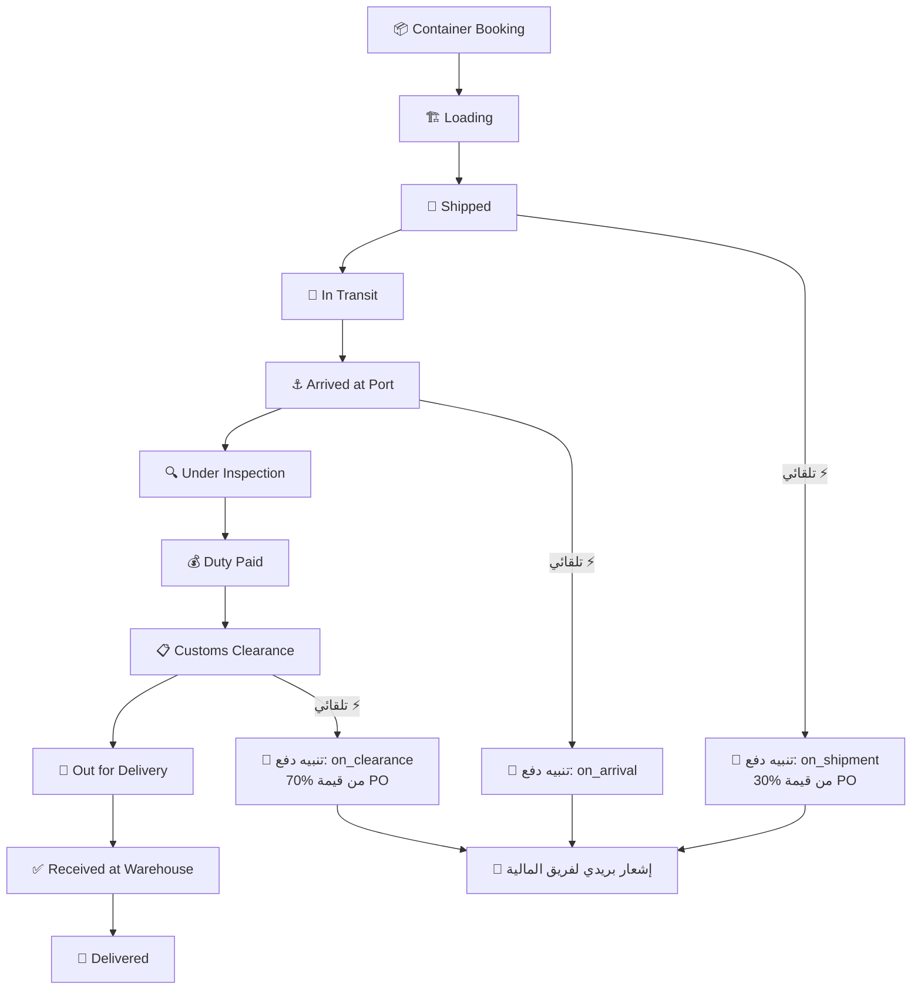

# 📘 دليل نظام إدارة سلاسل الإمداد
### Muntajat Supply Chain Management System
**الإصدار:** 2.0 | **التاريخ:** مايو 2026

---

## 📌 نظرة عامة

نظام إدارة سلاسل الإمداد هو جزء من **منصة مُنتجات للأتمتة** (Muntajat Automation Platform). يهدف لاستبدال ملفات Excel اليدوية بنظام ذكي مربوط مع **SAP Business One** مباشرةً.

### ما يفعله النظام:
- ✅ إدارة **الموردين** العالميين وعقودهم
- ✅ إنشاء ومتابعة **أوامر الشراء** (Purchase Orders)
- ✅ تتبع **الشحنات** من المصنع حتى المستودع
- ✅ حساب **تكلفة التوطين** (Landed Cost) لكل شحنة
- ✅ إدارة **تنبيهات الدفع** الآلية
- ✅ إدارة **وكلاء الشحن والمخلّصين الجمركيين**
- ✅ **لوحة تحكم** إحصائية حية

### ما لا يفعله النظام:
- ❌ لا يستبدل SAP — يعمل **بجانبه**
- ❌ لا ينشئ فواتير أو يعالج مدفوعات فعلية
- ❌ لا يتحكم في المخزون (هذا دور SAP)

---

## 🏗️ هيكل النظام (7 وحدات)

```
📦 Supply Chain
├── 👤 Suppliers (الموردين)
├── 📋 Payment Policies (سياسات الدفع)
├── 🛒 Purchase Orders (أوامر الشراء)
├── 🚢 Shipments (الشحنات)
├── 🧮 Landed Costs (تكلفة التوطين) ← جديد
├── 🔔 Payment Alerts (تنبيهات الدفع)
├── 🚛 Forwarders (وكلاء الشحن)
└── 📋 Brokers (المخلّصين الجمركيين) ← جديد
```

---

## 👥 صلاحيات المستخدمين

### الأدوار المتاحة:

| الدور | الوصف | صلاحيات سلاسل الإمداد |
|-------|-------|----------------------|
| **Super Admin** | مدير النظام | ✅ كامل — إنشاء وتعديل وحذف كل شيء |
| **Finance** | فريق المالية | ✅ قراءة كل البيانات + إدارة تنبيهات الدفع + يستقبل إشعارات الدفع تلقائياً |
| **Stakeholder** | أصحاب المصلحة (مدير تنفيذي) | 👁️ **قراءة فقط** — يشوف كل البيانات لكن لا يقدر ينشئ أو يعدّل أو يحذف |
| **Operator** | موظف سلاسل الإمداد | ✅ إنشاء وتعديل الشحنات والموردين وأوامر الشراء |

### تفصيل الصلاحيات لكل شاشة:

| الشاشة | Super Admin | Finance | Operator | Stakeholder |
|--------|-------------|---------|----------|-------------|
| الموردين | ✅ كامل | 👁️ قراءة | ✅ تعديل | 👁️ قراءة |
| أوامر الشراء | ✅ كامل | 👁️ قراءة | ✅ إنشاء/تعديل | 👁️ قراءة |
| الشحنات | ✅ كامل | 👁️ قراءة | ✅ إنشاء/تعديل | 👁️ قراءة |
| Landed Cost | ✅ كامل | ✅ كامل | ✅ إنشاء/تعديل | 👁️ قراءة |
| تنبيهات الدفع | ✅ كامل | ✅ إدارة | 👁️ قراءة | 👁️ قراءة |
| الوكلاء/المخلّصين | ✅ كامل | 👁️ قراءة | ✅ تعديل | 👁️ قراءة |

> [!NOTE]
> **Stakeholder** يستخدم تقنية `ReadOnlyStakeholder` — يشوف كل البيانات بدون القدرة على التعديل. مناسب للمدراء التنفيذيين اللي يحتاجون يراقبون فقط.

---

## 🔄 سير العمل (Workflow) — خطوة بخطوة

### المرحلة 1: إعداد المورد
```
1️⃣ المورد يُزامن تلقائياً من SAP (sap:sync-suppliers)
   → الحقول التلقائية: الكود، الاسم، العملة، حد الائتمان، رصيد الطلبات

2️⃣ موظف سلاسل الإمداد يُكمل البيانات يدوياً:
   → التصنيف، الهدف السنوي، تاريخ العقد، شروط التجديد
   → رابط نسخة العقد، الخصم المتفق عليه، ميزانية التسويق
```

### المرحلة 2: إعداد سياسة الدفع
```
3️⃣ إنشاء سياسة دفع (Payment Policy) للمورد:
   → مثال: "30% on Shipment + 70% on Clearance"
   → بنود السياسة:
     • on_shipment → 30% → بعد 0 يوم
     • on_clearance → 70% → بعد 30 يوم
```

### المرحلة 3: إنشاء أمر الشراء
```
4️⃣ إنشاء Purchase Order:
   → اختيار المورد → العملة تتعبأ تلقائياً
   → اختيار سياسة الدفع
   → إضافة الأصناف (Products) مع الكميات والأسعار
   → حفظ → رقم PO يُولّد تلقائياً
```

### المرحلة 4: إنشاء الشحنة
```
5️⃣ إنشاء Shipment مرتبطة بـ PO:
   → اختيار PO الأصل
   → تحديد وكيل الشحن (Forwarder) + المخلّص (Broker)
   → إدخال بيانات النقل: Mode, Incoterms, Origin, Container
   → إدخال التواريخ: ETD, ETA

6️⃣ تحديث حالة الشحنة (وهنا يبدأ السحر 🪄):
```

### ⚡ الأتمتة: ماذا يحدث عند تغيير حالة الشحنة؟



> [!IMPORTANT]
> **الأتمتة تعمل تلقائياً!** عند تغيير حالة الشحنة إلى:
> - `Shipped` أو `In Transit` → يُنشأ تنبيه دفع بشرط `on_shipment`
> - `Arrived at Port` → يُنشأ تنبيه بشرط `on_arrival`
> - `Clearance` أو `Received` أو `Delivered` → يُنشأ تنبيه بشرط `on_clearance`
>
> **لا تحتاج تفعل أي شيء يدوياً** — النظام يحسب المبلغ ويُنبّه المالية تلقائياً!

### المرحلة 5: حساب تكلفة التوطين (Landed Cost)
```
7️⃣ إنشاء Landed Cost:
   → اختيار أمر الشراء (PO)
   → إدخال سعر الصرف (أو يُسحب من SAP)
   → إدخال نسبة الضريبة (افتراضي 15%)

8️⃣ ضغط "📥 Import from PO":
   → النظام يسحب كل أصناف PO مع أسعارها تلقائياً

9️⃣ إدخال التكاليف الإضافية:
   → تكلفة الشحن (من فاتورة الفورورد)
   → تكلفة البيان الجمركي
   → تكلفة المخلّص

🔟 ضغط "🔄 Calculate":
   → النظام يحسب كل شيء تلقائياً! 🎯
```

### المرحلة 6: المراجعة والتسعير
```
1️⃣1️⃣ مراجعة النتائج:
   → تكلفة الوحدة بالريال
   → تكلفة الوحدة مع الضريبة
   → إدخال سعر الجملة المقترح (يدوي)
   → النظام يحسب هامش الربح تلقائياً

1️⃣2️⃣ تحديث الحالة:
   → Preparation Status: Draft → Ready
   → Pricing Status: Pending → Priced
```

---

## 📊 شرح الشاشات

### 1. شاشة الموردين (Suppliers)
**الوصول:** Supply Chain → Suppliers

| القسم | الوصف | المصدر |
|-------|-------|--------|
| **SAP Master Data** | كود المورد، اسمه، عملته، حد ائتمانه، البلد | 🔵 من SAP تلقائي |
| **Classification & Admin** | التصنيف، مدير الحساب، البريد | 🟢 يدوي |
| **Performance & Contracts** | الهدف، العقد، التجديد، رابط العقد | 🟢 يدوي |
| **Financial Terms** | الخصم، ميزانية التسويق، المكافآت | 🟢 يدوي |
| **Financial Summary** | المبلغ المستحق، المتبقي لتحقيق الهدف | 🟠 حساب تلقائي |

> [!TIP]
> **الحقول الرمادية (Disabled)** تُزامن من SAP ولا يمكن تعديلها يدوياً. إذا كان هناك خطأ، عدّله في SAP وشغّل المزامنة.

---

### 2. شاشة أوامر الشراء (Purchase Orders)
**الوصول:** Supply Chain → Purchase Orders

**الأعمدة المهمة في الجدول:**
- **Shipment Progress**: شريط يوضح كم تم شحنه من الكمية المطلوبة
- **Currency**: عملة المورد (تتعبأ تلقائياً)
- **PQ Ref/Value**: مرجع وقيمة عرض الأسعار

**ملاحظة:** عند اختيار المورد، العملة تتحدث تلقائياً ويتم فلترة سياسات الدفع الخاصة بهذا المورد فقط.

---

### 3. شاشة الشحنات (Shipments)
**الوصول:** Supply Chain → Shipments

**7 أقسام في الفورم:**

| القسم | المحتوى |
|-------|---------|
| **Shipment Details** | PO، الحالة (11 خيار)، الإعلان، الوصف |
| **Transport & Route** | الوكيل، المخلّص، وسيلة النقل، Incoterms، البلد، الميناء، المستودع، BOL |
| **Key Dates** | ETD، ETA، تاريخ الاستلام، أيام الوصول (حسابي) |
| **Shipment Lines** | أصناف الشحن الجزئي (Partial Shipment) مع مراقبة الكميات |
| **Containers & Cost** | الحاويات (نوع + رقم + بالتات + تكلفة) |
| **Customs & Clearance** | رقم البيان، فاتورة الشحن، فاتورة التخليص، سعر الصرف |
| **Notes & Remarks** | ملاحظات |

**الفلاتر المتاحة:**
- حسب الحالة (متعدد)
- حسب وسيلة النقل
- حسب الوكيل
- حسب المستودع
- "Arriving within 7 days" — فلتر سريع

**عمود ذكي: "Arriving In"**
- 🟢 `15 days` — وقت كافي
- 🟡 `5 days` — يقترب
- 🔴 `3d overdue` — متأخر!

---

### 4. 🧮 شاشة تكلفة التوطين (Landed Cost) — الأهم!
**الوصول:** Supply Chain → Landed Costs

هذه الشاشة تستبدل ملف **"Master Landing Cost"** (294 شيت Excel).

#### كيف تستخدمها:

**الخطوة 1: إنشاء سجل جديد**
- اختر **أمر الشراء** → العملة تظهر تلقائياً
- أدخل **سعر الصرف** (مثلاً 3.7500 للدولار)
- أدخل **نسبة الضريبة** (افتراضي 15%)
- احفظ

**الخطوة 2: استيراد الأصناف**
- اضغط زر **📥 Import from PO** في أعلى الصفحة
- النظام يسحب كل أصناف الـ PO مع أسعارها وكمياتها

**الخطوة 3: إدخال التكاليف**
- **Total Shipping (Supplier Currency)**: إجمالي تكلفة الشحن من فاتورة الفورورد
- **Customs Declaration Cost**: تكلفة البيان الجمركي (بالريال)
- **Broker Cost**: تكلفة المخلّص (بالريال)

**الخطوة 4: الحساب**
- اضغط زر **🔄 Recalculate All**
- النظام يحسب **كل شيء تلقائياً**!

#### المعادلات الحسابية:

```
📐 المعادلات (تعمل تلقائياً عند ضغط Calculate):

① إجمالي قيمة الصنف = الكمية × سعر الوحدة
② نسبة المشاركة = قيمة الصنف ÷ إجمالي كل الأصناف
③ تكلفة الشحن للوحدة = (إجمالي الشحن × نسبة المشاركة) ÷ الكمية
④ التكلفة الكلية للوحدة = سعر الوحدة + تكلفة الشحن
⑤ التكلفة بالريال = التكلفة الكلية × سعر الصرف
⑥ التكلفة بالريال + ضريبة = التكلفة × 1.15
⑦ هامش الربح % = (سعر الجملة − التكلفة) ÷ سعر الجملة
⑧ الربح للوحدة = سعر الجملة − التكلفة بالريال
```

**الخطوة 5: التسعير**
- أدخل **Wholesale Price** (سعر الجملة المقترح) لكل صنف
- النظام يحسب **GP%** (هامش الربح) و**Profit/Unit** تلقائياً
- حدّث حالة التسعير: Pending → **Priced** ✅

---

### 5. شاشة تنبيهات الدفع (Payment Alerts)
**الوصول:** Supply Chain → Payment Alerts

> [!WARNING]
> **هذه التنبيهات تُنشأ تلقائياً!** لا تحتاج إنشاءها يدوياً.

- تظهر في الـ Navigation كـ Badge (رقم أحمر/أصفر)
- كل تنبيه يحتوي: المبلغ المستحق، تاريخ الاستحقاق، الشحنة، أمر الشراء
- الحالات: `pending` (معلق) → `paid` (مدفوع) / `overdue` (متأخر)
- فريق المالية يستقبل **إشعار بريدي** تلقائياً

---

### 6. شاشة وكلاء الشحن (Forwarders)
**الوصول:** Supply Chain → Forwarders

قائمة معتمدين يتم اختيارها عند إنشاء الشحنة:
- الاسم
- المسؤول التواصل
- الهاتف
- البريد
- الحالة (فعّال/غير فعّال)

---

### 7. شاشة المخلّصين الجمركيين (Brokers) — جديد
**الوصول:** Supply Chain → Brokers

مثل وكلاء الشحن تماماً — قائمة معتمدين لوكلاء التخليص الجمركي.

---

## 📊 لوحة التحكم (Dashboard)

في الصفحة الرئيسية توجد 4 بطاقات إحصائية + 3 رسوم بيانية:

### البطاقات:
| البطاقة | الوصف |
|---------|-------|
| **Active Purchase Orders** | عدد أوامر الشراء غير المُزامنة مع SAP |
| **Active Shipments** | عدد الشحنات في الطريق |
| **Pending Payments** | إجمالي المبالغ المستحقة (ريال) |
| **Expiring Contracts** | عقود تنتهي خلال 30 يوم |

### الرسوم البيانية:
- **Shipment Status Chart**: توزيع الشحنات حسب الحالة
- **Payment Due Timeline**: جدول زمني للمدفوعات المستحقة
- **Supplier Performance Chart**: أداء الموردين (الهدف vs المحقق)

---

## 🔗 التكامل مع SAP

### البيانات المُزامنة تلقائياً:

| البيانات | الأمر | التوقيت |
|----------|------|---------|
| الموردين | `sap:sync-suppliers` | يومي (Cron Job) |
| المنتجات | `sap:sync-products` | يومي |
| العلامات التجارية | `sap:sync-brands` | يومي |

### ما لا يُكتب في SAP:
- الشحنات ← فقط في النظام
- Landed Cost ← فقط في النظام
- تنبيهات الدفع ← فقط في النظام

> [!NOTE]
> النظام **يقرأ من SAP لكن لا يكتب فيه** في وحدة سلاسل الإمداد. الهدف هو تتبع وإدارة العمليات اللوجستية خارج SAP.

---

## 📝 ملاحظات مهمة

### 1. العملات
- كل مورد له عملة مختلفة محددة في SAP
- العملة تنتقل تلقائياً: **المورد → أمر الشراء → الشحنة → تنبيه الدفع**
- لا تحتاج تحدد العملة يدوياً أبداً

### 2. الشحن الجزئي (Partial Shipment)
- يمكنك إنشاء أكثر من شحنة لنفس أمر الشراء
- **ShipmentQuantityGuard**: النظام يمنعك من شحن كمية أكبر من المطلوب
- **Shipment Progress**: عمود في أوامر الشراء يوضح نسبة الشحن المكتمل

### 3. انتهاء العقود
- النظام يراقب تلقائياً تواريخ انتهاء العقود
- عند اقتراب الانتهاء (30 يوم) يظهر تنبيه في لوحة التحكم

### 4. "Arriving In" (أيام الوصول)
- عمود ذكي في جدول الشحنات يحسب الأيام المتبقية للوصول
- أخضر = وقت كافي | أصفر = أقل من 7 أيام | أحمر = متأخر

---

## ❓ الأسئلة الشائعة

**س: كيف أنشئ تنبيه دفع؟**
ج: **لا تحتاج!** التنبيهات تُنشأ تلقائياً عند تغيير حالة الشحنة.

**س: كيف أعرف تكلفة الوحدة بالريال؟**
ج: أنشئ Landed Cost → Import from PO → أدخل التكاليف → Calculate. التكلفة تظهر في عمود "Cost SAR".

**س: المورد الجديد ما يظهر في النظام؟**
ج: المورد يُزامن من SAP. تأكد من إضافته في SAP أولاً، ثم انتظر المزامنة اليومية أو شغّل `sap:sync-suppliers` يدوياً.

**س: كيف أتابع شحنة معينة؟**
ج: من شاشة الشحنات، استخدم الفلاتر (المورد، الحالة، الوكيل) أو البحث بالوصف.

**س: الأرقام في Landed Cost غير صحيحة؟**
ج: تأكد من: (1) سعر الصرف صحيح (2) تكلفة الشحن بعملة المورد وليس بالريال (3) اضغط "Recalculate All" بعد أي تعديل.

---

## 📞 للدعم الفني
- **المنصة:** Muntajat Automation Platform
- **الرابط:** `http://62.138.14.178/admin`
- **تسجيل الدخول:** استخدم بيانات حسابك المُسجّل
