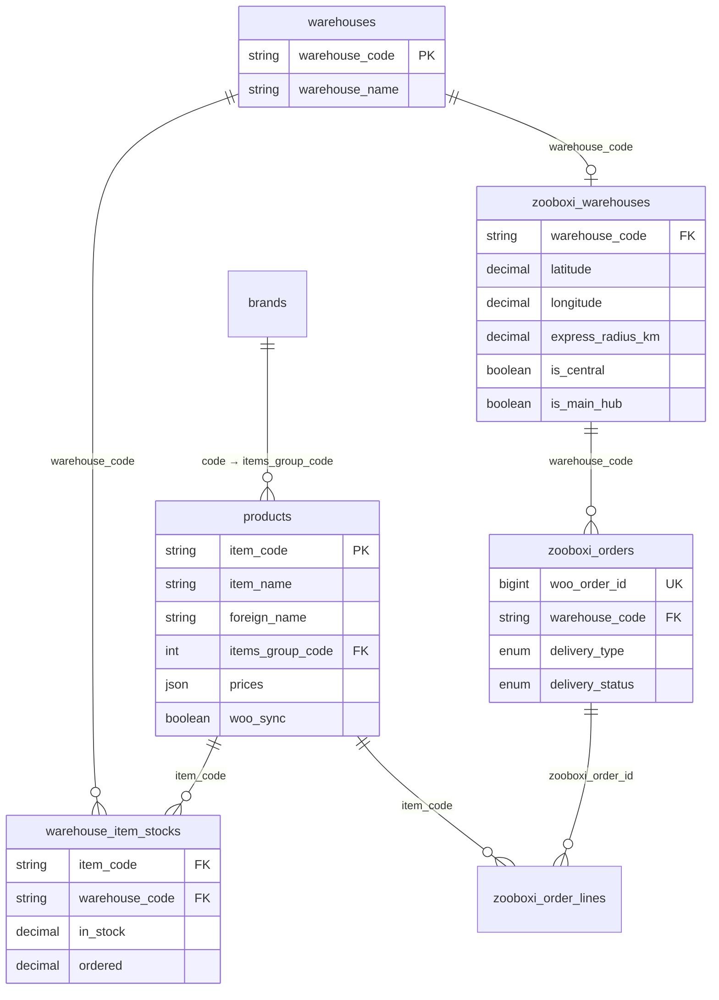

# 02 — خريطة قاعدة البيانات

## المصدر: sapconnect (Laravel / MySQL)

هذا المستند يوثق الجداول الموجودة في sapconnect المرتبطة بـ Zooboxi والجداول الجديدة المطلوبة.

---

## الجداول الموجودة (Existing Tables)

### 1. `products` — المنتجات

```sql
CREATE TABLE products (
    id              BIGINT PRIMARY KEY AUTO_INCREMENT,
    item_code       VARCHAR(255) INDEX,          -- الكود الفريد (SAP)
    item_name       VARCHAR(255) NULL,           -- الاسم بالعربي
    foreign_name    VARCHAR(255) NULL,           -- الاسم بالإنجليزي
    items_group_code INT NULL,                    -- كود البراند/المجموعة
    inventory_uom   VARCHAR(255) NULL,           -- وحدة القياس
    piece_barcode   VARCHAR(255) NULL,           -- الباركود
    sales_items_per_unit FLOAT NULL,             -- عدد القطع بالكرتون
    source          ENUM('test','production'),    -- البيئة
    prices          JSON NULL,                    -- الأسعار (price lists)
    create_date     DATE NULL,                    -- تاريخ الإنشاء في SAP
    update_date     DATE NULL,                    -- تاريخ التحديث في SAP
    u_portal_sync   VARCHAR(255) NULL,           -- حالة مزامنة البوابة
    u_proprt1       VARCHAR(255) NULL,           -- خاصية مخصصة 1
    u_proprt2       VARCHAR(255) NULL,           -- خاصية مخصصة 2
    u_proprt3       VARCHAR(255) NULL,           -- خاصية مخصصة 3
    u_proprt4       VARCHAR(255) NULL,           -- خاصية مخصصة 4
    u_proprt5       VARCHAR(255) NULL,           -- خاصية مخصصة 5
    created_at      TIMESTAMP,
    updated_at      TIMESTAMP,
    UNIQUE (item_code, source)
);
```

**العلاقات**:
- `items_group_code` → `brands.code`
- `item_code` → `warehouse_item_stocks.item_code`

**الصور**: `https://ppte.sa/imghd/{item_code[0:4]}/{item_code}.png`

---

### 2. `brands` — البراندات

```sql
CREATE TABLE brands (
    id      BIGINT PRIMARY KEY AUTO_INCREMENT,
    code    INT,                               -- كود البراند في SAP
    name    VARCHAR(255),                      -- اسم البراند
    source  ENUM('test','production'),
    created_at TIMESTAMP,
    updated_at TIMESTAMP
);
```

**الصور**: `https://ppte.sa/imghd/brands/{item_code[0:4]}.png`

**العلاقات**:
- `code` ← `products.items_group_code` (hasMany)
- `brands` ↔ `suppliers` (belongsToMany عبر pivot table)

---

### 3. `warehouses` — المستودعات

```sql
CREATE TABLE warehouses (
    id                  BIGINT PRIMARY KEY AUTO_INCREMENT,
    warehouse_code      VARCHAR(255),              -- كود المستودع في SAP
    warehouse_name      VARCHAR(255) NULL,         -- اسم المستودع
    sales_employee_code VARCHAR(255) NULL,         -- كود موظف المبيعات
    source              ENUM('test','production'),
    created_at          TIMESTAMP,
    updated_at          TIMESTAMP,
    UNIQUE (warehouse_code, source)
);
```

---

### 4. `warehouse_item_stocks` — كميات المخزون لكل مستودع

```sql
CREATE TABLE warehouse_item_stocks (
    id              BIGINT PRIMARY KEY AUTO_INCREMENT,
    item_code       VARCHAR(255),              -- كود المنتج
    warehouse_code  VARCHAR(255),              -- كود المستودع
    in_stock        DECIMAL(15,4) DEFAULT 0,   -- الكمية المتاحة
    ordered         DECIMAL(15,4) DEFAULT 0,   -- الكمية المطلوبة (PO)
    created_at      TIMESTAMP,
    updated_at      TIMESTAMP,
    UNIQUE (item_code, warehouse_code)
);
```

**العلاقات**:
- `item_code` → `products.item_code` (belongsTo)
- `warehouse_code` → `warehouses.warehouse_code` (belongsTo)

---

### 5. `customers` — العملاء

```sql
CREATE TABLE customers (
    id                          BIGINT PRIMARY KEY AUTO_INCREMENT,
    card_code                   VARCHAR(255),    -- كود العميل في SAP
    card_name                   VARCHAR(255),    -- اسم العميل
    card_type                   VARCHAR(255),    -- نوع العميل
    phone1                      VARCHAR(255),
    contact_person              VARCHAR(255),
    vat_liable                  VARCHAR(255),
    federal_tax_id              VARCHAR(255),    -- الرقم الضريبي
    cellular                    VARCHAR(255),
    city                        VARCHAR(255),
    county                      VARCHAR(255),
    country                     VARCHAR(255),
    mail_city                   VARCHAR(255),
    mail_county                 VARCHAR(255),
    mail_country                VARCHAR(255),
    email_address               VARCHAR(255),
    ship_to_default             VARCHAR(255),
    company_registration_number VARCHAR(255),
    u_portal_sync               VARCHAR(255),
    u_iban                      VARCHAR(255),
    create_date                 DATE,
    create_time                 TIME,
    update_date                 DATE,
    update_time                 TIME,
    created_at                  TIMESTAMP,
    updated_at                  TIMESTAMP
);
```

---

## الجداول الجديدة المطلوبة (New Tables)

### 6. `zooboxi_warehouses` — إعدادات مستودعات Zooboxi

```sql
CREATE TABLE zooboxi_warehouses (
    id                  BIGINT PRIMARY KEY AUTO_INCREMENT,
    warehouse_code      VARCHAR(255),              -- FK → warehouses.warehouse_code
    display_name_ar     VARCHAR(255),              -- اسم العرض بالعربي
    display_name_en     VARCHAR(255),              -- اسم العرض بالإنجليزي
    city                VARCHAR(100),              -- المدينة
    address_ar          TEXT NULL,                 -- العنوان الكامل بالعربي
    address_en          TEXT NULL,                 -- العنوان الكامل بالإنجليزي
    latitude            DECIMAL(10,8),             -- خط العرض (GPS)
    longitude           DECIMAL(11,8),             -- خط الطول (GPS)
    express_radius_km   DECIMAL(5,2) DEFAULT 10,   -- نطاق التوصيل السريع بالكيلومتر
    is_central          BOOLEAN DEFAULT FALSE,     -- هل هو مستودع مركزي للمدينة؟
    is_main_hub         BOOLEAN DEFAULT FALSE,     -- هل هو المستودع المركزي الرئيسي (للشحن)؟
    is_pickup_enabled   BOOLEAN DEFAULT TRUE,      -- هل يدعم الاستلام من الفرع؟
    is_active           BOOLEAN DEFAULT TRUE,      -- هل المستودع فعال؟
    working_hours       JSON NULL,                 -- ساعات العمل
    phone               VARCHAR(20) NULL,
    created_at          TIMESTAMP,
    updated_at          TIMESTAMP,
    UNIQUE (warehouse_code)
);
```

**مثال على `working_hours`**:
```json
{
  "sunday":    {"open": "09:00", "close": "23:00"},
  "monday":    {"open": "09:00", "close": "23:00"},
  "tuesday":   {"open": "09:00", "close": "23:00"},
  "wednesday": {"open": "09:00", "close": "23:00"},
  "thursday":  {"open": "09:00", "close": "23:00"},
  "friday":    {"open": "14:00", "close": "23:00"},
  "saturday":  {"open": "09:00", "close": "23:00"}
}
```

---

### 7. `zooboxi_orders` — طلبات Zooboxi

```sql
CREATE TABLE zooboxi_orders (
    id                  BIGINT PRIMARY KEY AUTO_INCREMENT,
    woo_order_id        BIGINT UNIQUE,             -- WooCommerce Order ID
    woo_order_number    VARCHAR(50),               -- رقم الطلب المعروض
    warehouse_code      VARCHAR(255),              -- المستودع المسؤول عن التنفيذ
    delivery_type       ENUM('express','same_day','shipping','pickup'),
    delivery_status     ENUM('pending','preparing','out_for_delivery','delivered','cancelled'),
    customer_latitude   DECIMAL(10,8) NULL,
    customer_longitude  DECIMAL(11,8) NULL,
    customer_city       VARCHAR(100) NULL,
    sap_doc_entry       VARCHAR(50) NULL,          -- رقم الفاتورة في SAP
    sap_synced_at       TIMESTAMP NULL,            -- وقت المزامنة مع SAP
    total_amount        DECIMAL(12,2),
    notes               TEXT NULL,
    created_at          TIMESTAMP,
    updated_at          TIMESTAMP
);
```

---

### 8. `zooboxi_order_lines` — تفاصيل أسطر الطلب

```sql
CREATE TABLE zooboxi_order_lines (
    id                  BIGINT PRIMARY KEY AUTO_INCREMENT,
    zooboxi_order_id    BIGINT,                    -- FK → zooboxi_orders.id
    item_code           VARCHAR(255),              -- كود المنتج
    warehouse_code      VARCHAR(255),              -- المستودع الذي يتم السحب منه
    quantity            DECIMAL(10,2),
    unit_price          DECIMAL(10,2),
    total_price         DECIMAL(12,2),
    created_at          TIMESTAMP,
    updated_at          TIMESTAMP
);
```

---

### 9. `zooboxi_sync_logs` — سجل المزامنة

```sql
CREATE TABLE zooboxi_sync_logs (
    id              BIGINT PRIMARY KEY AUTO_INCREMENT,
    sync_type       ENUM('products','stock','prices','orders'),
    direction       ENUM('pull','push'),           -- pull = من SAP, push = إلى SAP
    status          ENUM('running','completed','failed'),
    records_total   INT DEFAULT 0,
    records_synced  INT DEFAULT 0,
    records_failed  INT DEFAULT 0,
    error_message   TEXT NULL,
    started_at      TIMESTAMP,
    completed_at    TIMESTAMP NULL,
    created_at      TIMESTAMP
);
```

---

## مخطط العلاقات (ERD)



---

## الحقول الجديدة المطلوب إضافتها

### في جدول `products` (موجود):

```sql
ALTER TABLE products ADD COLUMN woo_sync BOOLEAN DEFAULT FALSE AFTER u_proprt5;
ALTER TABLE products ADD COLUMN woo_product_id BIGINT NULL AFTER woo_sync;
ALTER TABLE products ADD COLUMN woo_synced_at TIMESTAMP NULL AFTER woo_product_id;
```

| الحقل | النوع | الوصف |
|-------|-------|-------|
| `woo_sync` | BOOLEAN | هل المنتج ينشر في WooCommerce |
| `woo_product_id` | BIGINT NULL | ID المنتج في WooCommerce |
| `woo_synced_at` | TIMESTAMP NULL | آخر وقت مزامنة |
